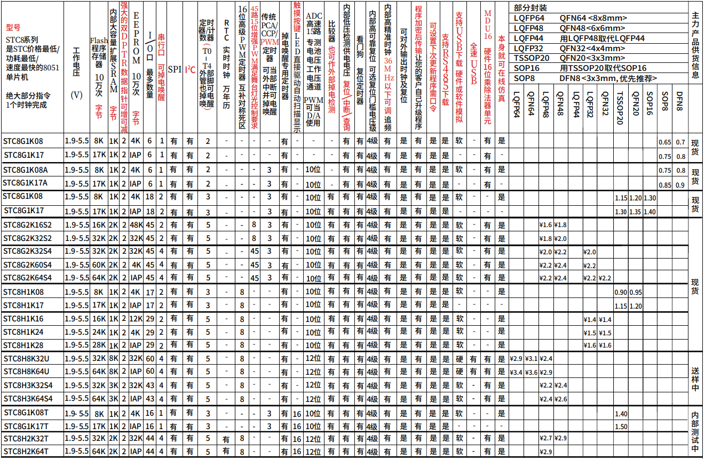

# [STC8](https://github.com/SoCXin/STC8)

* [STC](https://www.stcmcudata.com/): [8051](https://github.com/SoCXin/8051)
* [L2R1](https://github.com/SoCXin/Level): 24 MHz

## [简介](https://github.com/SoCXin/STC8/wiki)

[STC8](https://github.com/SoCXin/STC8)

### 关键特性

* EEPROM
* USB下载

#### 封装规格 (4)

* LQFP64 (10×10mm)
* LQFP48 (7×7mm)
* LQFP32 (7×7mm)
* TSSOP20
* SOP8/DFN8

### [资源收录](https://github.com/SoCXin)

* [参考资源](src/)
* [参考文档](docs/)
* [参考工程](project/)

### [选型建议](https://github.com/SoCXin)

[STC8](https://github.com/SoCXin/STC8)

### [探索芯世界 www.SoC.xin](http://www.SoC.Xin)
